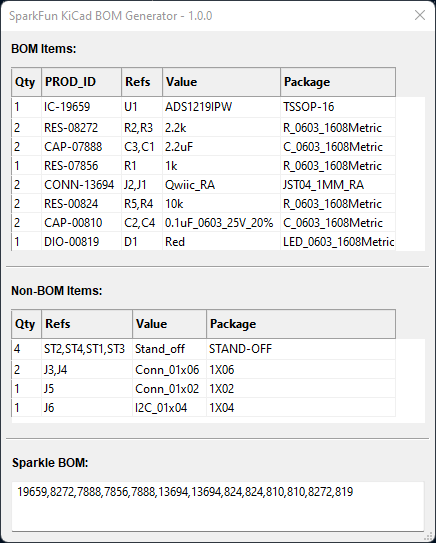
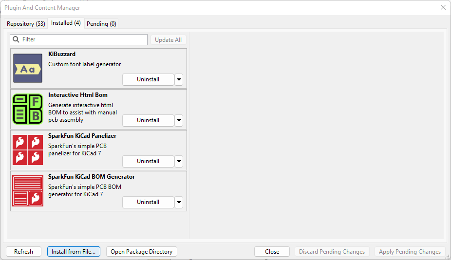
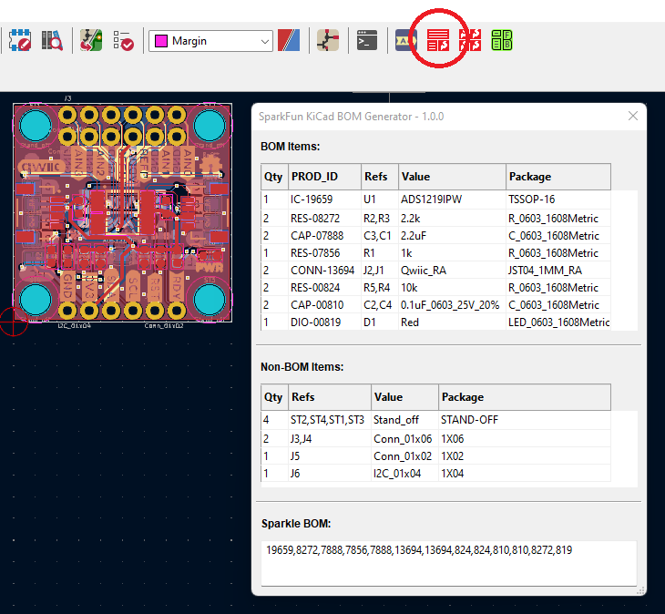

# SparkFun PCB BOM Generator plugin for KiCad 7 / 8

This plugin generates the Bill Of Materials (BOM) for a KiCad 7 / 8 PCB.

We've tried to keep this BOM generator simple and easy-to-use, while also including all the essential features of the original [SparkFun BOM Generator for Eagle](https://github.com/sparkfun/SparkFun_Eagle_Settings/blob/main/ulp/SparkFun-BOM_Generator.ulp). If you need a more comprehensive BOM generator, please check out [@openscopeproject](https://github.com/openscopeproject)'s [Interactive HTML BOM plugin for KiCad](https://github.com/openscopeproject/InteractiveHtmlBom).

## Limitations

This is a simple BOM generator and is very SparkFun-specific. It lists all board components on a PCB and identifies the ones with a SparkFun product ID (PROD_ID). It then generates a CSV list of those IDs which can be copied and pasted into our stock control system.

## Installation and Usage

The BOM Generator is not registered in the KiCad Plugin and Content Manager (PCM). To install manually, open the [GitHub Repo Releases page](https://github.com/sparkfun/SparkFun_KiCad_BOM_Generator/releases) and download the `SparkFunKiCadBOMGenerator-pcm.zip` file attached to the latest release. Then use the PCM _**Install from File...**_ option and select the .zip file to install it. For best results, **Uninstall** the previous version first, **Apply Pending Changes**, and then **Install from File...**.

The BOM generator plugin runs inside the KiCad PCB Editor window.

Click the icon to open the BOM generator GUI:

## License and Credits

The code for this plugin is licensed under the MIT license. Please see `LICENSE` for more info.

It is based heavily on [@openscopeproject](https://github.com/openscopeproject)'s [Interactive HTML BOM plugin for KiCad](https://github.com/openscopeproject/InteractiveHtmlBom).
Special thanks to [@qu1ck](https://github.com/qu1ck) for the original BOM plugin and the many useful contributions on [KiCad Info](https://forum.kicad.info/).

## How It Works

The plugin GUI itself is designed with [wxFormBuilder](https://github.com/wxFormBuilder/wxFormBuilder/releases) and stored in `text_dialog.fbp`.
Copy and paste the wx Python code from wxFormBuilder into `./SparkFunKiCadBOMGenerator/dialog/dialog_text_base.py`.

`.github/workflows/build_asset_release.yml` generates the .zip file containing the plugin Python code (`./plugins`), icon (`./resources`) and the Plugin and Content Manager (PCM) `metadata.json`. The workflow automatically attaches the zip file to each release as an asset. Edit `./SparkFunKiCadBOMGenerator/resource/_version.py` first and update the version number. `build.py` is called by the workflow, copies `metadata_template.json` into `metadata.json` and then updates it with the correct version and download URL. The version number is also added to the .zip filename. New versions of the BOM generator need to be installed manually, it is not registered in the KiCad Plugin and Content Manager (PCM).

- Your friends at SparkFun

